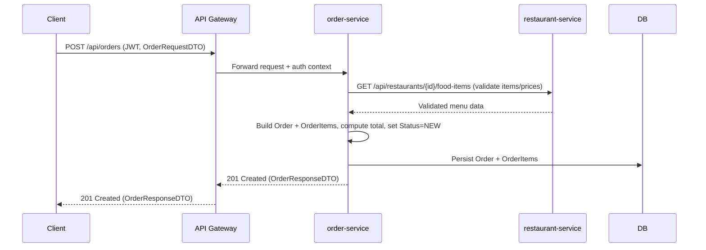

# Technical Context Document

## 1. System Overview
- Foodie is implemented as a Spring Boot–based microservices backend, fronted by a Spring Cloud Gateway API gateway and using Eureka for service discovery.
- The primary execution model is synchronous HTTP APIs exposed via the gateway for authentication, user profile, restaurant discovery, search, cart, and order management.
- Each core business domain (users, restaurants/search/cart, orders, registry/gateway) is implemented as an independently deployable service with its own datastore.
- The current focus is a single-city deployment, commission-on-order business model, and platform-owned delivery, with future services planned for payment, delivery orchestration, and richer observability.

## 2. Architecture Overview
- **Services and responsibilities**
  - **api-gateway**
    - Spring Cloud Gateway application with Eureka discovery (`@EnableDiscoveryClient`).
    - Terminates external HTTP requests and routes them to internal services based on path predicates (e.g., `/api/auth/**`, `/api/users/**`, `/api/orders/**`, `/api/restaurants/**`, `/api/search/**`, `/api/cart/**`).
    - Provides a `LoggingFilter` for request/response logging.
  - **service-registry**
    - Eureka server acting as the service registry; all other services register and discover each other via this component.
  - **user-service**
    - Manages user accounts, roles, authentication, and profiles.
    - Exposes `/api/auth` for registration/login and `/api/users` for profile access.
    - Implements JWT-based stateless authentication and role-aware user modeling (customer, restaurant owner, delivery driver, admin).
  - **restaurant-service**
    - Owns restaurant and menu data (`Restaurant`, `FoodItem`).
    - Provides APIs for listing restaurants and their food items, as well as managing carts (`Cart`, `CartItem`).
    - Contains `SearchService` backed by Elasticsearch repositories to support keyword-based food item search.
    - Acts as the source of truth for restaurant menus and pricing used by order-service.
  - **order-service**
    - Owns the order lifecycle (`Order`, `OrderItem`, `Status`).
    - Exposes `/api/orders` for creating and retrieving orders.
    - In target design, validates order items and prices against restaurant-service before persisting, then manages order state transitions and enforces cancellation rules.
- **Internal boundaries and layering**
  - Within each service, the code largely follows a standard Spring MVC layering: controllers → services → repositories/entities.
  - Cross-service boundaries are HTTP-based (via RestTemplate in order-service and via the gateway for client traffic).
  - Data ownership is strictly per-service; there is no shared database schema across services.

### System Context (Mermaid)
```mermaid
graph LR
  Client[Web / Mobile Client] --> APIGW[API Gateway]
  APIGW --> US[user-service]
  APIGW --> RS[restaurant-service]
  APIGW --> OS[order-service]
  APIGW --> SR[Eureka Service Registry]

  US --> PGUsers[(PostgreSQL - users)]
  RS --> MySQL[(MySQL - restaurant/menu)]
  RS --> ES[(Elasticsearch - search index)]
  OS --> H2[(H2 - dev) / PostgreSQL - orders (prod)]
```

## 3. Execution Model
- **Synchronous request/response APIs**
  - All main flows (auth, browsing, search, cart operations, order creation, order retrieval) are synchronous HTTP endpoints.
  - There are no asynchronous workers, queues, or scheduled jobs in the current codebase.
- **Request flow examples**
  - **Authentication**
    - Client → `api-gateway` → `user-service` `/api/auth/register` or `/api/auth/login`.
    - `user-service` validates credentials, issues JWT tokens, and persists users/roles.
  - **Browse and search**
    - Client → `api-gateway` → `restaurant-service` `/api/restaurants` and `/api/restaurants/{id}/food-items`.
    - For keyword search: Client → `api-gateway` → `restaurant-service` `/api/search?keyword=...`, which calls `SearchService` and Elasticsearch.
  - **Cart operations**
    - Client → `api-gateway` → `restaurant-service` `/api/cart` endpoints (add, remove, get) that manipulate `Cart` and `CartItem` entities associated with `customerId`.
  - **Order creation (target design)**
    - Client sends an authenticated POST `/api/orders` with an `OrderRequestDTO` derived from cart contents.
    - `api-gateway` validates JWT (as the primary auth boundary for order placement) and forwards the call to order-service.
    - order-service re-validates ordered items and prices against restaurant-service before persisting.

### Place Order Flow (Target) – Mermaid


## 4. Data & State Management
- **Datastores**
  - **user-service**
    - PostgreSQL database (`foodie_users`).
    - Entities: `User`, `Role`, `Address`, timestamp fields for auditing.
  - **restaurant-service**
    - MySQL database (`restaurant` schema) for `Restaurant`, `FoodItem`, `Cart`, `CartItem`.
    - Elasticsearch cluster for search indexing via `FoodItemSearchRepository`.
  - **order-service**
    - Currently uses in-memory H2 (`jdbc:h2:mem:orderdb`) for development and testing.
    - Target production datastore is PostgreSQL for durability and consistency with user-service.
    - Entities: `Order`, `OrderItem`, `Status` enum.
- **State transitions**
  - Orders are timestamped with `orderTime` and maintain a `Status` lifecycle: `NEW`, `PROCESSING`, `CONFIRMED`, `OUT_FOR_DELIVERY`, `DELIVERED`, `CANCELLED`.
  - Cancellation rules (e.g., only within ~2 minutes of `orderTime`) are intended to be enforced inside order-service on cancel endpoints.
- **Consistency model**
  - Strong consistency within each service’s local database.
  - Cross-service consistency is managed at the application level via synchronous HTTP calls (e.g., order-service → restaurant-service for validation), without sagas or message-driven orchestration yet.
  - Cart state (restaurant-service) and order state (order-service) are distinct; at checkout, cart data is transformed into an `Order` snapshot.

## 5. External Dependencies
- **Infrastructure and databases**
  - PostgreSQL for user-service (and planned for order-service in production).
  - MySQL for restaurant-service.
  - Elasticsearch for search indexing and retrieval in restaurant-service.
  - Eureka server for service discovery.
- **Libraries and frameworks**
  - Spring Boot for all services.
  - Spring Cloud Gateway and Spring Cloud Netflix Eureka for gateway and discovery.
  - Spring Data JPA for ORM to underlying relational databases.
  - Spring Security with JWT support in user-service.
- **Mock/external APIs**
  - order-service currently has a configurable `restaurant.service.url` that points to a Postman mock for development; in real deployments, it will be configured to talk to restaurant-service.
- **Planned observability stack**
  - ELK (Elasticsearch, Logstash, Kibana) is planned as the main observability stack; current logging is basic but aligns well with that future direction.

## 6. Key Technical Decisions
- **Microservices architecture vs monolith**
  - Each core domain (users, restaurants/search/cart, orders, gateway/registry) is an independent Spring Boot service with its own schema, supporting independent scaling and deployment, and mapping directly to business domains described in the Business Context.
- **Per-service databases**
  - user-service → PostgreSQL, restaurant-service → MySQL + Elasticsearch, order-service → (dev) H2 → (prod) PostgreSQL, to maintain clear data ownership and avoid cross-service coupling at the database level.
- **API Gateway & service registry**
  - Spring Cloud Gateway provides a single entrypoint and path-based routing, aligning with a clean contract for external clients.
  - Eureka allows services to discover each other without hardcoding hostnames, important for scaling and resilience.
- **Authentication & authorization strategy**
  - JWT-based stateless authentication in user-service, using Spring Security and a `JwtAuthenticationFilter`.
  - For now, gateway-level auth is considered sufficient for order placement flows, with the gateway validating JWTs before forwarding to order-service.
- **Order validation against restaurant-service (option a)**
  - To protect against price or menu manipulation, the target design is for order-service to re-validate each order item’s identity and price against restaurant-service at order time, rather than trusting client-submitted data.
- **Database technology for orders**
  - Choosing PostgreSQL for order-service in production provides consistent operational tooling with user-service and meets relational/transactional needs for order data.

## 7. Failure Modes & Reliability
- **Common failure modes**
  - restaurant-service unavailable during order creation: order-service cannot validate items/prices, so order creation should fail fast with an appropriate error.
  - user-service unavailable: customers cannot authenticate; all protected operations (profile, placing orders) are blocked.
  - Elasticsearch unavailable: search endpoints degrade or fail, but core ordering from direct restaurant browsing may still function.
- **Retries and idempotency**
  - There is currently no explicit retry logic or idempotency handling in order-service or restaurant-service.
  - Clients calling `/api/orders` should be aware that retrying a failed call could create duplicate orders unless idempotency tokens are introduced in the future.
- **Cancellation rule enforcement**
  - The business rule that orders can only be cancelled within ~2 minutes is planned to be enforced inside order-service, by comparing current time to `orderTime` at cancel time.
  - This design localizes time-based logic where order data lives, reducing cross-service race conditions.
- **Logging and diagnostics**
  - `LoggingFilter` in api-gateway logs request method/URI and response status for each call, providing a minimal audit trail across all routed endpoints.
  - Additional structured logging will be required as the system moves towards ELK-based observability.

## 8. Security & Access Control
- **Authentication**
  - user-service issues JWTs on login, which are then presented on subsequent requests.
  - Security configuration in user-service:
    - `/api/auth/**` and `/actuator/**` are publicly accessible.
    - All other paths require authentication, enforced via Spring Security.
- **Authorization & roles**
  - Roles modeled via `Role` and `RoleType` enum: `ROLE_CUSTOMER`, `ROLE_RESTAURANT_OWNER`, `ROLE_DELIVERY_DRIVER`, `ROLE_ADMIN`.
  - While the role model is in place, detailed role-based endpoint restrictions beyond basic auth are not yet widely implemented in controllers.
  - Admin approval workflows for restaurant owners and drivers are planned, but not yet encoded in security rules.
- **Service boundaries**
  - For now, security is primarily enforced at user-service and at the gateway (conceptually) for order placement.
  - Internal service-to-service calls are assumed to happen in a trusted network; there is no mTLS or service-level auth in the current code.

## 9. Observability & Operations
- **Current state**
  - api-gateway includes a global `LoggingFilter` that logs basic request/response information.
  - user-service and other services expose Spring Boot Actuator endpoints (e.g., health, info, metrics as configured).
- **Planned evolution**
  - Integration with an ELK stack is planned for log aggregation, search, and dashboards.
  - Over time, additional context (correlation IDs, user IDs, order IDs) should be added to logs to support tracing end-to-end flows.
  - Metrics and alerts (e.g., failed order rate, search error rate) can be layered on top of Actuator and ELK.

## 10. Scalability & Evolution
- **Horizontal scalability**
  - Each service can be scaled independently based on its traffic profile (e.g., search and restaurant-service for browse-heavy loads, order-service for peak ordering windows).
  - Eureka-based discovery and gateway routing support dynamic scaling.
- **Data scaling**
  - PostgreSQL and MySQL provide standard vertical and horizontal scaling patterns (partitioning, read replicas).
  - Elasticsearch is well-suited to scaling query-heavy search workloads as data and traffic grow.
- **Functional evolution**
  - New services (e.g., delivery-service, payment-service, promotion-service) can be introduced behind the gateway without breaking clients, by adding routes and new internal service calls.
  - The architecture can extend from single-city to multi-city by enriching domain models with location/zone metadata and by sharding data or services by geography if needed.

## 11. Assumptions & Open Questions
- **Assumptions**
  - order-service will be updated to:
    - Use PostgreSQL in production.
    - Re-validate ordered items and prices against restaurant-service at order time.
    - Implement cancel endpoints that enforce the 2-minute cancellation rule.
  - api-gateway will perform JWT validation for endpoints like `/api/orders/**` before forwarding calls to internal services.
  - Observability will be built out using ELK, with existing logging updated to include structured, contextual information.
- **Open technical questions**
  - Exact shape of order-status transitions and who/what triggers each transition (e.g., when does an order move from PROCESSING to CONFIRMED or OUT_FOR_DELIVERY, and which service owns those transitions).
  - Whether idempotency keys or at-least-once semantics will be required for order creation as traffic and failure scenarios grow more complex.
  - How service-to-service security will evolve (e.g., mTLS, service accounts, or a service mesh) as the system moves beyond a trusted internal network.
